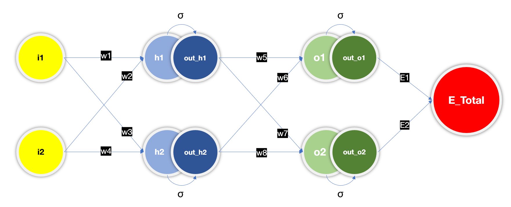

Explanation 
================

This assignment is to train a neural network model from scratch. Here we have taken a simple network to show different steps of training including back propagation. 
This excels sheet take us through step by step forward propagation and back propagation steps of the network.
Let’s look at the diagram below and discuss over it.

For simplicity we will take 
===============================

- Two Input neurons (i1, i2)
- One hidden layer of size 2 (h1, h2)
- Activation function on hidden layers (out_h1, out_h2)
- One output layer (O1, O2)
- Activation Function on Output (out_O1, out_O2)
- Target (t1, t2)
- Error Total (Total = E1 + E2)
- Weights (w1,w2 ………, w8)

Forward Propagation
======================

- h1=w1i1+w2i2	 	 	 
- out_h1 = σ(h1) = σ(w1i1+w2i2)	 	 
- h2=w3i1+w4i2	 	 	 
- out_h2 = σ(h2) = σ(w3i1+w4i2)	 	 
 	 	 	 	 
- o1 = w5*out_h1 + w6 * out_h2	 	 
- out_o1 = σ(o1) = σ(w5*out_h1 + w6 * out_h2)
- o2 = w7*out_h1 + w8 * out_h2	 	 
- out_o2 = σ(o2) = σ(w7*out_h1 + w8 * out_h2)
 	 	 	 	 
- E_Total = E1 + E2	 	 	 
- E1 = 1/2 *(t1 - out_o1) **2	 	 
- E2 = 1/2 *(t2 - out_o2) **2	 	 
 	 	 	 	 

We have considered Mean Square Error (MSE) loss. 

Back Propagation Steps 
==========================

The first step while performing back propagation is to take the partial derivative w.r.t the weights near to the output layer (W5, W6, W7, W8)

- ӘE/Әw5 = (ӘE1+ӘE2)/Әw5 = ӘE1/Әw5= (ӘE1/Әout_o1 ) * (Әout_o1/Әo1)*(Әo1/Әw5) 

Error 2 Does not propagate through w5. Hence ӘE/Әw5 = (ӘE1+ӘE2)/Әw5 = ӘE1/Әw5

- Based on chain rule;

- ӘE1/Әw5= (ӘE1/Әout_o1) * (Әout_o1/Әo1) *(Әo1/Әw5)

- (ӘE1/Әout_o1 ) = Ә(1/2 *(t1 - out_o1) **2)/Әout_o1  = (out_o1 - t1)

- (Әout_o1/Әo1) = Ә(σ(o1) )/Әo1 =  σ(o1)/1- +σ(-o1) = out_o1 * (1-out_o1)

- (Әo1/Әw5) = Ә(w5*out_h1 + w6 * out_h2)/Әw5 = out_h1

So, putting it altogether;

- ӘE/Әw5 = (out_o1 - t1) * out_o1 * (1-out_o1) * out_h1

Similarly w6 will not have any impact of E2 ; 

- ӘE/Әw6 = (out_o1 - t1) * out_o1 *(1-out_o1) * out_h2

W7 & w8 will not have any impact of E1 

- ӘE/Әw7 = (out_o2 - t2) * out_o2 *(1-out_o2) * out_h1

- ӘE/Әw8 = (out_o2 - t2) * out_o2*(1-out_o2) * out_h2

Now let’s Look into other weights w1,w2,w3,w4 

ӘE/Әw1
==========

Based on chain rule ;

ӘE/Әw1 = [(ӘE1/Әout_o1) *  (Әout_o1/Әo1) *  (Әo1/Әout_h1) *  (Әout_h1/Әh1)*  (Әh1/Әw1)]+ [(ӘE2/Әout_o2) *  (Әout_o2/Әo2) *  (Әo2/Әout_h1) *  (Әout_h1/Әh1)*  (Әh1/Әw1)]

1.	(ӘE1/Әout_o1 ) = Ә(1/2 *(t1 - out_o1) **2)/Әout_o1  = (out_o1 - t1)
2.	(Әout_o1/Әo1) = Ә(σ(o1) )/Әo1 =  σ(o1)/1+σ(-o1) = out_o1 * (1-out_o1)
3.	(Әo1/Әout_h1) = Ә(w5*out_h1 + w6 * out_h2)/Әout_h1 = w5
4.	(Әout_h1/Әh1) = Ә(σ(h1))/Әh1 = σ(h1) *( 1- σ(h1)) = out_h1 * (1-out_h1)
5.	(Әh1/Әw1) = Ә(w1i1+w2i2)/Әw1 = i1
6.	(ӘE2/Әout_o2 ) = Ә(1/2 *(t2 - out_o2) **2)/Әout_o2  = (out_o2 - t2)
7.	(Әout_o2/Әo2) = Ә(σ(o2) )/Әo2 =  σ(o2)/1+σ(-o2) = out_o2 * (1-out_o2)
8.	(Әo2/Әout_h1) = Ә(w7*out_h1 + w8 * out_h2)/Әout_h1 = w7
9.	(Әout_h1/Әh1) = Ә(σ(h1))/Әh1 = σ(h1) *( 1- σ(h1)) = out_h1 * (1-out_h1)
10.	(Әh1/Әw1) = Ә(w1i1+w2i2)/Әw1 = i1

Putting it altogether we got 

ӘE/Әw1 =  [(out_o1 - t1) * out_o1 * (1-out_o1) * w5 + (out_o2 - t2) * out_o2 * (1-out_o2) * w7] * out_h1 * (1-out_h1) * i1

Similarly ;
ӘE/Әw2 =  [(out_o1 - t1) * out_o1 * (1-out_o1) * w5 + (out_o2 - t2) * out_o2 * (1-out_o2) * w7] * out_h1 * (1-out_h1) * i2

 ӘE/Әw3 =  [(out_o1 - t1) * out_o1 * (1-out_o1) * w6 + (out_o2 - t2) * out_o2 * (1-out_o2) * w8] * out_h2 * (1-out_h2) * i1
 
ӘE/Әw4 =  [(out_o1 - t1) * out_o1 * (1-out_o1) * w6 + (out_o2 - t2) * out_o2 * (1-out_o2) * w8] * out_h2 * (1-out_h2) * i2

Now let’s put all in tabular format, do simple mathematics 

We performed this training for multiple learning rates (0.1, 0.2, 0.5, 0.8, 1.0, 2.0) keeping the initial weights same. This shows the impact of learning rate over training 
Each cell of the attached excel sheet shows the formula of back propagation which is 

Here we haven’t considered bias.

Loss Curve comparison based on learning rate 
=================================================

That’s it, we could successfully train a neural network from scratch.  It was exciting but at the same time we saw how time consuming and error prone this whole process was. The complexity rises exponentially when we increase the number of inputs and layers. 

I am sure here we can say it’s practically impossible for someone to perform this manually and find the best performing model. 
So let’s appreciate the great work the inventors have done to save our time and effort. 

Kudos .
