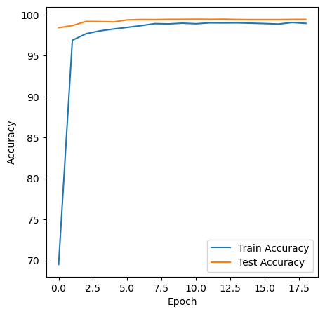
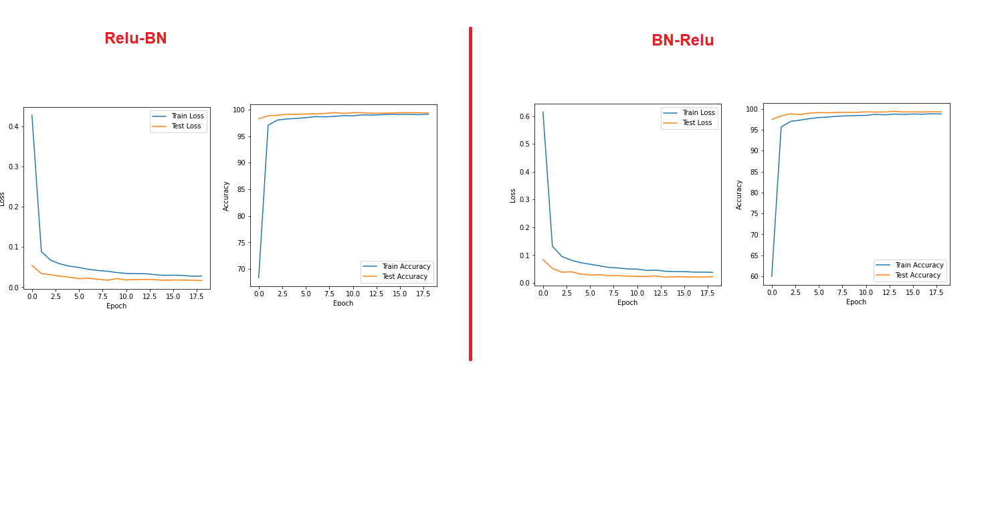

Training a Neural Network with MNIST Data
===============================================

Training a Model with MNIST data is very simple. It’s basically a classification model to look into the image and predict the handwritten digit accurately. All of us can do it. But to make it a little fun we have added some constraints to it. Let’s understand the model input, output and architecture first before getting into the code. SO here is how the readme has been structured

1.	Input 
2.	Constraints
3.	Network 
4.	Parameters
5.	Output
6.	How we arrived at it
7.	Takeaway

Input
======
MNIST data which is nothing but the images of handwritten digits 

Constraints
===========
1.	The Parameters must be with in 12k – 18k
2.	We must run the model for exactly 19 epochs
3.	Must use Batch Normalization, FC Layer and GAP
4.	Dropout value must be 0.069 only
5.	We must consider using 1 x1 kernel to show the power of going deep without putting extra burden on GPU. Basically consolidating 

Network 
==============
The Network consists of around 6 Convolution layers, 2 Maxpool Layers, GAP Layer, FC layer as well.

Here is the structure if the network in details 

Typical Structure 
==================
1. Convolution Layer of 3 x 3 Kernel with Padding of 1 
2. ReLu
3. Batch Normalization - Regularization Technique 
4. Dropout              - Regularization Technique 
5. Maxpool after 3 Layers 

-	Example 
self.conv1 = nn.Sequential(
            nn.Conv2d(1, 8, 3, padding=1, bias=False),
            nn.ReLU(),
            nn.BatchNorm2d(8),
            nn.Dropout2d(p=dropout_prob)
        )

Additional Structures
======================
1. Convolution Layer of 1 x 1 Kernel to consolidate without convolution 
2. Global Average Pooling 
3. Linear Layer 

Special Considerations
========================
1. The Maxpool layers are placed such a way that the receptive field is 7 x 7 or 9 x9 (Ideally for imagenet type of images 11 x 11 is better). But MNIST is an easy dataset so 7 x 7 should be good enough

2. No ReLu, BN or Dropout towards the end of the netowrk (Target prediction zone)

3. As less parameter as possible (near to the lower limit of 12000)
4. Dropout of 0.069 - As asked
5. Rotation of -5% to 5 %
6. Normalization
7. Batch size of 128 

Parameters
============

The model has been built to train with minimum number of parameters without putting extra burden on GPU. The toal number of parameters we have taken is roughly 12k

For hyperparameters I would encourage to take a look at the model code as it’s self-explanatory 

Output
======

‘<=99.4%” Accuracy in less than 20 epochs 

What you think? It’s easy or difficult?

Let me tell you if you understand the concept then it’s all about spending some time with multiple iterations.

How we arrived at it
=====================

If you see the code and the outcome it’s pretty evident that the model validated with over 99.4 % accuracy multiple times. But here I want to put few special mentions to ensure that we not only now what we get but also major experiments we did. But for readability, I will write only important ones and the outcomes only
Used Even size kernel and avg2d 
In this network we used only Maxpooling layer with an intention to keep Maxpool as far as possible to the last layer. We also used avg2d instead of adaptive one.
The model trained and validation accuracy reached 99.4 % multiple times but the training curve was not smooth.

- Did we Try networks without Batch Normalization, Dropout and higher value of dropout? Yes, we did. The accuracy was also > 99.4 %. But again, the curve was not smooth 

Again, surprisingly when I updated the same model with 1 x1 kernel and adaptive pooling with GAP at 5x5 image size the model could not achieve 99.4 % accuracy. Stuck at 99.37 % - 99.38 %. Initially I thought it might be for random initialization but after running it multiple times I found that’s not the case

Now this network which is the final one gave accuracy multiple times between 1-20 epoch. The curve is also smooth.

Log
======
Currently Executing Epoch: 1
Loss=0.1358441859483719 Batch_id=468 Accuracy=86.33: 100%|███████████████████████████| 469/469 [01:12<00:00,  6.51it/s]

Test set: Average loss: 0.0569, Accuracy: 9840/10000 (98.40%)

Currently Executing Epoch: 2
Loss=0.08169911056756973 Batch_id=468 Accuracy=97.08: 100%|██████████████████████████| 469/469 [01:11<00:00,  6.57it/s]

Test set: Average loss: 0.0417, Accuracy: 9866/10000 (98.66%)

Currently Executing Epoch: 3
Loss=0.06112154200673103 Batch_id=468 Accuracy=97.81: 100%|██████████████████████████| 469/469 [01:12<00:00,  6.46it/s]

Test set: Average loss: 0.0294, Accuracy: 9917/10000 (99.17%)

Currently Executing Epoch: 4
Loss=0.05986931920051575 Batch_id=468 Accuracy=98.09: 100%|██████████████████████████| 469/469 [01:11<00:00,  6.53it/s]

Test set: Average loss: 0.0270, Accuracy: 9915/10000 (99.15%)

Currently Executing Epoch: 5
Loss=0.02401156723499298 Batch_id=468 Accuracy=98.31: 100%|██████████████████████████| 469/469 [01:14<00:00,  6.28it/s]

Test set: Average loss: 0.0262, Accuracy: 9911/10000 (99.11%)

Currently Executing Epoch: 6
Loss=0.12531009316444397 Batch_id=468 Accuracy=98.48: 100%|██████████████████████████| 469/469 [01:11<00:00,  6.52it/s]

Test set: Average loss: 0.0228, Accuracy: 9936/10000 (99.36%)

Currently Executing Epoch: 7
Loss=0.1358746439218521 Batch_id=468 Accuracy=98.74: 100%|███████████████████████████| 469/469 [01:12<00:00,  6.49it/s]

Test set: Average loss: 0.0189, Accuracy: 9941/10000 (99.41%)

Currently Executing Epoch: 8
Loss=0.12351590394973755 Batch_id=468 Accuracy=98.84: 100%|██████████████████████████| 469/469 [01:11<00:00,  6.54it/s]

Test set: Average loss: 0.0189, Accuracy: 9940/10000 (99.40%)

Currently Executing Epoch: 9
Loss=0.07895346730947495 Batch_id=468 Accuracy=98.83: 100%|██████████████████████████| 469/469 [01:13<00:00,  6.36it/s]

Test set: Average loss: 0.0184, Accuracy: 9943/10000 (99.43%)

Currently Executing Epoch: 10
Loss=0.03930727019906044 Batch_id=468 Accuracy=98.94: 100%|██████████████████████████| 469/469 [01:10<00:00,  6.64it/s]

Test set: Average loss: 0.0186, Accuracy: 9943/10000 (99.43%)

Currently Executing Epoch: 11
Loss=0.11707573384046555 Batch_id=468 Accuracy=98.91: 100%|██████████████████████████| 469/469 [01:11<00:00,  6.53it/s]

Test set: Average loss: 0.0182, Accuracy: 9944/10000 (99.44%)

Currently Executing Epoch: 12
Loss=0.0062669492326676846 Batch_id=468 Accuracy=98.96: 100%|████████████████████████| 469/469 [01:13<00:00,  6.37it/s]

Test set: Average loss: 0.0180, Accuracy: 9943/10000 (99.43%)

Currently Executing Epoch: 13
Loss=0.05105641484260559 Batch_id=468 Accuracy=98.92: 100%|██████████████████████████| 469/469 [01:11<00:00,  6.58it/s]

Test set: Average loss: 0.0177, Accuracy: 9945/10000 (99.45%)

Currently Executing Epoch: 14
Loss=0.004239717498421669 Batch_id=468 Accuracy=98.95: 100%|█████████████████████████| 469/469 [01:14<00:00,  6.27it/s]

Test set: Average loss: 0.0180, Accuracy: 9941/10000 (99.41%)

Currently Executing Epoch: 15
Loss=0.017958058044314384 Batch_id=468 Accuracy=98.96: 100%|█████████████████████████| 469/469 [01:11<00:00,  6.53it/s]

Test set: Average loss: 0.0179, Accuracy: 9940/10000 (99.40%)

Currently Executing Epoch: 16
Loss=0.032220542430877686 Batch_id=468 Accuracy=98.88: 100%|█████████████████████████| 469/469 [01:12<00:00,  6.46it/s]

Test set: Average loss: 0.0177, Accuracy: 9940/10000 (99.40%)

Currently Executing Epoch: 17
Loss=0.010284353978931904 Batch_id=468 Accuracy=98.89: 100%|█████████████████████████| 469/469 [01:12<00:00,  6.47it/s]

Test set: Average loss: 0.0178, Accuracy: 9940/10000 (99.40%)

Currently Executing Epoch: 18
Loss=0.053424105048179626 Batch_id=468 Accuracy=98.95: 100%|█████████████████████████| 469/469 [01:11<00:00,  6.60it/s]

Test set: Average loss: 0.0178, Accuracy: 9942/10000 (99.42%)

Currently Executing Epoch: 19
Loss=0.01673886924982071 Batch_id=468 Accuracy=98.88: 100%|██████████████████████████| 469/469 [01:10<00:00,  6.62it/s]

Test set: Average loss: 0.0177, Accuracy: 9942/10000 (99.42%)

Takeaway
==============
We also modified the network to apply Batch Normalization before Relu. The network was smooth and achieved 99.4 % but not as many times as before. We understand the BN-Relu sequence doesn’t matter and performance should be same. We will investigate little more into it and find out why the performance degraded slightly in later. Is it because of the MNIST dataset? or something else.

A side-by-side comparison to keep in mind 
==========================================
 

