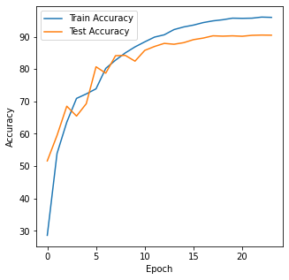

ERA - Assignment 10
======================
Developer
=================
• Nihar Kanungo (nihar.kanungo@gmail.com)

Explanation
============
This Package trains a Deep Neural Network on CIFAR data. It's been packaged properly and you may find details as following 

/data_loaders/cifar10_data_loader.py 
-------------------------------------

get_train_loader(batch_size, transform) : Loads the Training data and returns train loader 

get_test_loader(batch_size, transform)  : Loads the Test data and returns test loader 

get_classes()                           :  Returns the class labels 

data_transformations/data_transform_cifar10_custom_resnet.py
-------------------------------------------------------------

class album_Compose_train: 

    Defines all Transformation parameters
    Transforms and returns the modified image 
    
class album_Compose_test:

    Defines all Transformation parameters
    Transforms and returns the modified image 
    			
get_train_transform():
    Return Transformed Image
    
get_test_transform():
    Return Transformed Image
    

models/customresnet.py
------------------

The Custom Resnet Script is defined here 

PrepLayer - Conv 3x3 s1, p1) >> BN >> RELU [64k]

Layer1 -

X = Conv 3x3 (s1, p1) >> MaxPool2D >> BN >> RELU [128k]

R1 = ResBlock( (Conv-BN-ReLU-Conv-BN-ReLU))(X) [128k] 

Add(X, R1)

Layer 2 -

Conv 3x3 [256k]

MaxPooling2D

BN

ReLU

Layer 3 -

X = Conv 3x3 (s1, p1) >> MaxPool2D >> BN >> RELU [512k]

R2 = ResBlock( (Conv-BN-ReLU-Conv-BN-ReLU))(X) [512k]

Add(X, R2)

MaxPooling with Kernel Size 4

FC Layer 

SoftMax

models/main.py
------------------
    
def train_test_loader: Loads the data for training and testing 
  
def imshow(img): To display the image 
    
def get_model(CustomResNet) : Call the Resnet18 module and loads the model
  
def find_lr_value : Find the LR value 
      
def train_model : Trains the model 
    
    
utils/
-----

accuracy_utils.py                : Utility to calculate accuracy of training and testing 

cyclic_lr_plot.png               : Utility to plot clclic LR Plot

cyclic_lr_util.py

gradcamkz_util.py                : Gradcam Utility

misclassified_image_utils.py     : Utility to find misclassified images 

plot_metrics_utils.py            : Plot the Metrics

train_test_utils.py              : Train Test Utility
    
     
Constraints
-------------

Total Epochs = 24

Max at Epoch = 5

LRMIN = FIND

LRMAX = FIND

NO Annihilation

RandomCrop 32, 32 (after padding of 4) >> FlipLR >> Followed by CutOut(8, 8)

Batch size = 512

Target Accuracy: 90%

Result 
------
Achieved 91% Accuracy on 18th Epoch and constantly till 24th Epoch

Assumptions
-------------

With few more generalization we can achieve 93% accuracy and that's something i will try out 

Training Log
-------------

EPOCH: 18
Loss=0.16024799644947052 Batch_id=97 Accuracy=94.94: 100%|██████████| 98/98 [00:25<00:00,  3.82it/s]
  0%|          | 0/98 [00:00<?, ?it/s]
Test set: Average loss: 0.3261, Accuracy: 9028/10000 (90.28%)

Test Accuracy: 90.28 has increased. Saving the model
EPOCH: 19
Loss=0.09080487489700317 Batch_id=97 Accuracy=95.39: 100%|██████████| 98/98 [00:25<00:00,  3.82it/s]
  0%|          | 0/98 [00:00<?, ?it/s]
Test set: Average loss: 0.3278, Accuracy: 9017/10000 (90.17%)

EPOCH: 20
Loss=0.1523449420928955 Batch_id=97 Accuracy=95.54: 100%|██████████| 98/98 [00:25<00:00,  3.81it/s]
  0%|          | 0/98 [00:00<?, ?it/s]
Test set: Average loss: 0.3309, Accuracy: 9027/10000 (90.27%)

EPOCH: 21
Loss=0.12974657118320465 Batch_id=97 Accuracy=95.74: 100%|██████████| 98/98 [00:25<00:00,  3.82it/s]
  0%|          | 0/98 [00:00<?, ?it/s]
Test set: Average loss: 0.3349, Accuracy: 9014/10000 (90.14%)

EPOCH: 22
Loss=0.09581565856933594 Batch_id=97 Accuracy=95.83: 100%|██████████| 98/98 [00:25<00:00,  3.83it/s]
  0%|          | 0/98 [00:00<?, ?it/s]
Test set: Average loss: 0.3251, Accuracy: 9043/10000 (90.43%)

Test Accuracy: 90.43 has increased. Saving the model
EPOCH: 23
Loss=0.11339204758405685 Batch_id=97 Accuracy=95.96: 100%|██████████| 98/98 [00:25<00:00,  3.82it/s]
  0%|          | 0/98 [00:00<?, ?it/s]
Test set: Average loss: 0.3229, Accuracy: 9051/10000 (90.51%)

Test Accuracy: 90.51 has increased. Saving the model
EPOCH: 24
Loss=0.11349153518676758 Batch_id=97 Accuracy=95.96: 100%|██████████| 98/98 [00:25<00:00,  3.82it/s]
Test set: Average loss: 0.3211, Accuracy: 9047/10000 (90.47%)

Visualization
--------------

