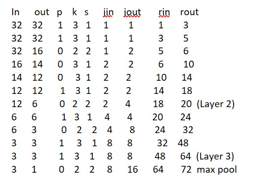
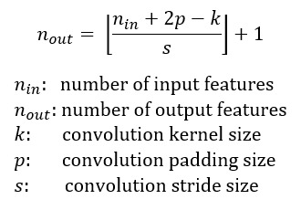

# Assignment12Resnet and Testing

The `Assignment12Resnet` class is a PyTorch Lightning module that serves as the core component for training and evaluating the custom ResNet model on the CIFAR-10 dataset. It inherits from `LightningModule`, which is a base class provided by PyTorch Lightning to streamline the training process.

## Assignment12Resnet Class

### Constructor

The constructor of `Assignment12Resnet` takes two parameters: `lr` and `data_dir`. The `lr` parameter is used to set the learning rate for the optimizer, and `data_dir` is the path to the directory where the CIFAR-10 dataset will be stored. It also initializes some dataset-specific attributes such as `num_classes`, `train_transform`, and `test_transform`, which define the data transformations for training and testing.

### Forward Method

The `forward` method defines how data flows through the model. It takes an input tensor `x` and passes it through the custom ResNet model (`self.model`). The output of the model is returned.

### Training Step

The `training_step` method is used during the training process. It takes a batch of data (`batch`) and the batch index (`batch_idx`). Inside this method, we compute the logits by calling the `forward` method with the input data (`x`). We then calculate the negative log-likelihood loss (`F.nll_loss`) between the logits and the true labels (`y`). The training loss is logged using `self.log("train_loss", loss)`, which will be displayed during training.

### Evaluation Methods

There are two evaluation methods: `validation_step` and `test_step`. Both methods are very similar and are used for validation and testing, respectively.

In each method, we take a batch of data (`batch`) and the batch index (`batch_idx`). We then use the `forward` method to compute the logits and calculate the negative log-likelihood loss (`F.nll_loss`) between the logits and the true labels (`y`). Additionally, we compute the predictions (`preds`) by taking the argmax of the logits along the class dimension. Finally, we calculate the accuracy using `torchmetrics.functional.accuracy`, passing the predictions and true labels along with the number of classes (10 for CIFAR-10). The computed loss and accuracy are logged using `self.log` with appropriate names, e.g., `self.log("val_loss", loss, prog_bar=True)` for validation loss.

### Configure Optimizers

The `configure_optimizers` method defines the optimizer and learning rate scheduler for the model. It sets up the SGD optimizer with a specific learning rate and momentum. Additionally, it uses a custom cyclic learning rate scheduler (`torch.optim.lr_scheduler.LambdaLR`) with the `custom_one_cycle_lr` function.

### Data Related Hooks

The `prepare_data` method is called once to download the CIFAR-10 dataset if it is not already available in the `data_dir`.

The `setup` method is called to assign the train and validation datasets for use in the data loaders. It downloads the dataset if it is not available and applies the appropriate transformations for training and testing.

### Data Loaders

The class defines three data loader methods: `train_dataloader`, `val_dataloader`, and `test_dataloader`. These methods return the data loaders for training, validation, and testing, respectively. The data loaders are created using the `torch.utils.data.DataLoader` class, and they utilize the train and test datasets prepared in the `setup` method.

## Testing the Model

After defining the `Assignment12Resnet` class, the notebook proceeds with testing the model.

1. A model instance is created: `model = Assignment12Resnet()`.
2. The model is trained using the `Trainer` class from PyTorch Lightave calculated the receptive field based on the custom network and decided to select layer2 as it has 6*6 as output size.
need to attach the image.

#Difficulties faced
1. Calculated the receptive field for custom model and obseved the output channel size to be 6*6.so decided to put at end of layer2. the snapshot for is 




2. As the layer2 components are not iterable for my custom restnet implementaion and so indexing them became a problem has to rewrite the code using nn.Sequential
and add those components. and prepared a model_dict dictionary to get the components of layer2.
3. I was not seeing the same accuracy after loading the model for inference. so I used 
    a)used pl_model = Assignment12Resnet().load_from_checkpoint("epoch=22-step=4140.ckpt",map_location=torch.device("cpu")) for loading
      instead of torch.load
    b)added the correct test transforms to be used for inferencing and after putting the model to eval() I was able to see accurate results. ning with a `fast_dev_run`, which runs only a few training batches to check if everything is working as expected. This allows you to quickly verify the code without training the model fully.

   ```python
   trainer = Trainer(fast_dev_run=True)
   trainer.fit(model)


