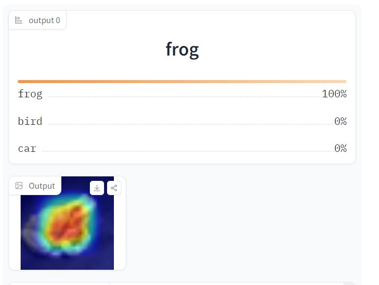
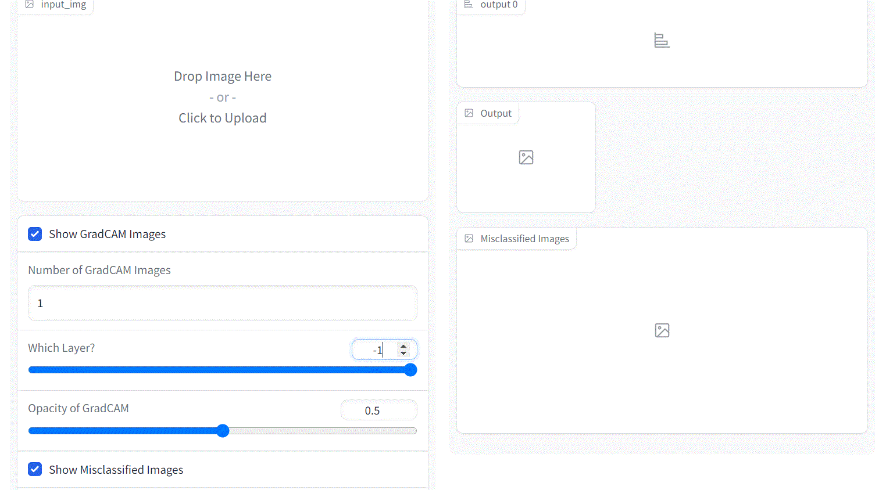
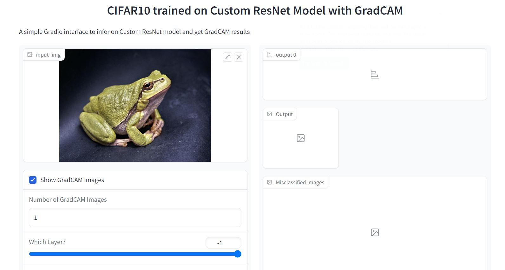
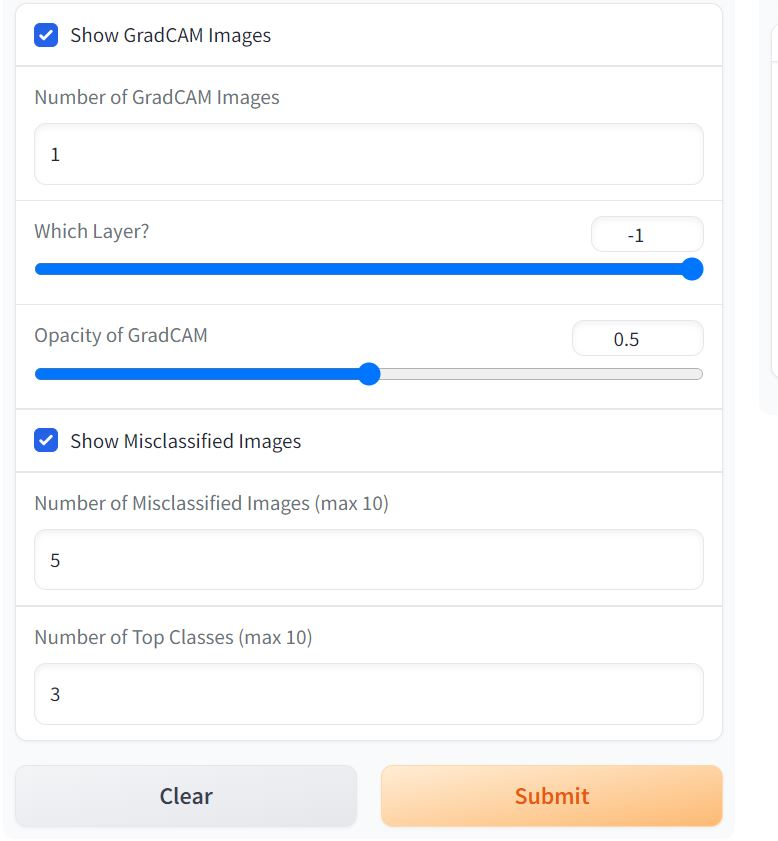
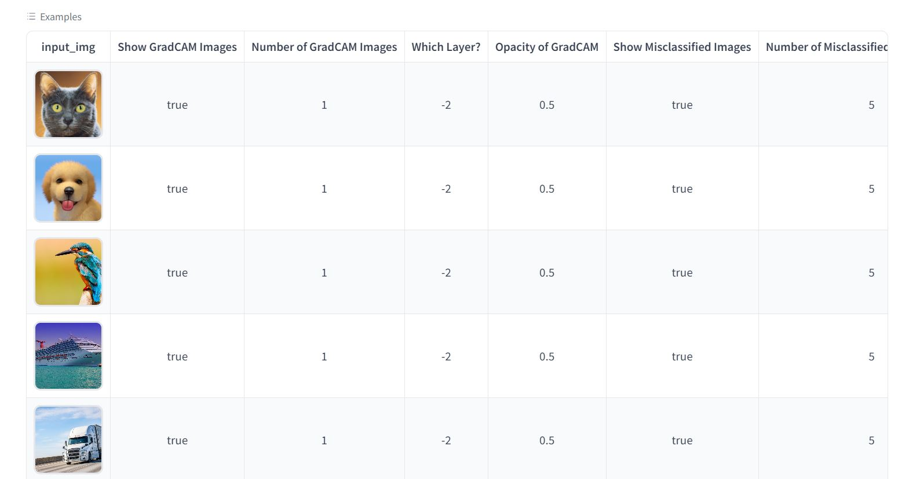
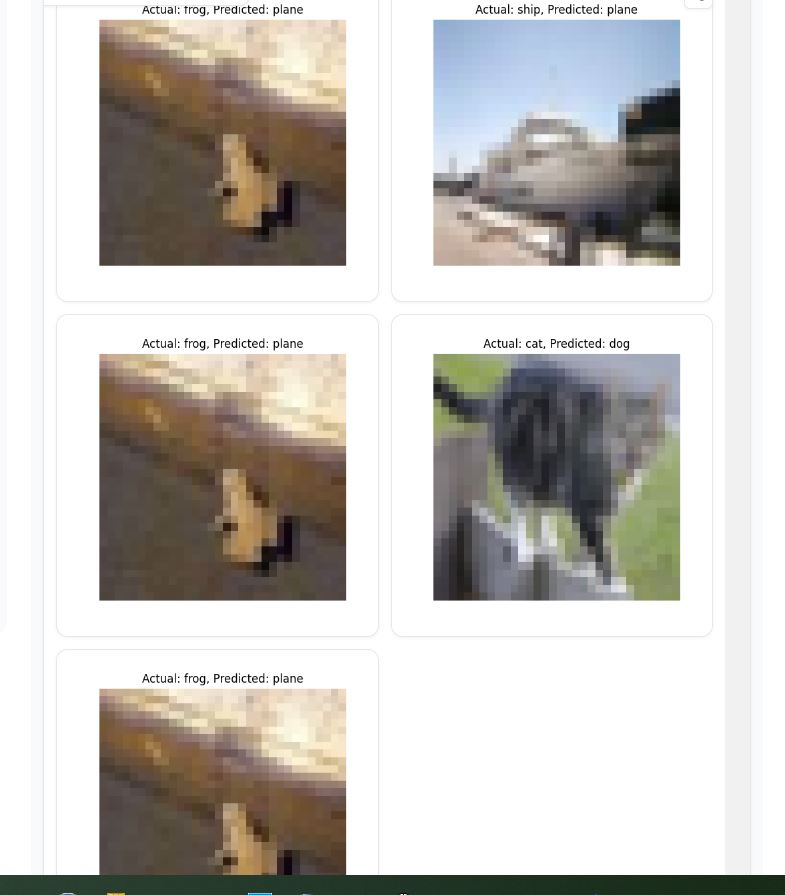

## Spaces APP
#### Step1 

Open the Spaces APP :  https://huggingface.co/spaces/sudhakardlal10/Session12Assignment
It will have options for  ShowGradCam Images,Which layer of GradCam Images,Opacity of GradCam,Show Misclassified images,Number of misclassified images,No of top classes.
As well as example input images

#### Step2

