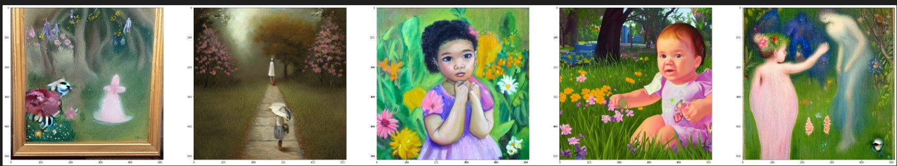
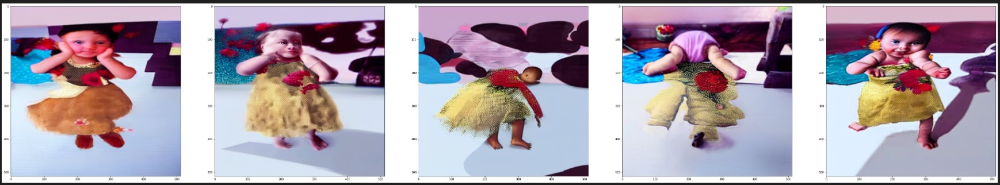

# ERAS20

# Generative Art and Image Alignment Application

This application is designed to create art in various styles based on user prompts and align generated images with a reference image.

# Prerequisites
Before running the code, ensure you have the following dependencies installed:

Transformers (version 4.25.1)
PyTorch
Diffusers library
Hugging Face Transformers
fastcore library
IPython
matplotlib
PIL (Pillow)
torchvision
tqdm
You can install these libraries using pip.

# Usage
Ensure you have the required dependencies installed.
Run the code using a Python environment that supports Jupyter Notebook or IPython. Ensure that you are using Python 3.
The code defines various functions and classes for generating art in different styles and aligning generated images. You can call these functions based on your requirements.
Styles_paintings Class
generate_styles: This method generates images in various styles based on the user's input prompt.
generate_styles_with_custom_loss: This method generates images with custom loss functions and aligns them with a reference image.
generate_final_image Function
This function takes an image (im1) and an input prompt (in_prompt) and generates images in different styles based on the input prompt. It also aligns the generated images with the reference image (im1).

# Sample Images

Without Loss Function

With Loss Function

# App Link

https://huggingface.co/spaces/nkanungo/stable_diffusion_experiment

# Acknowledgments
This code uses libraries and models provided by Hugging Face, and other open-source contributors.
Thanks to the developers and contributors of the libraries and models used in this application for their hard work and dedication to the open-source community.
License
This code is provided under an open-source license. Please refer to the license file for more details.

# Author

Nihar Kanungo

Manjunath Yellipeta

# Contact

For any questions or inquiries, please contact 

nihar.kanungo@gmail.com 

or 

yelipeta.manjunath@gmail.com

