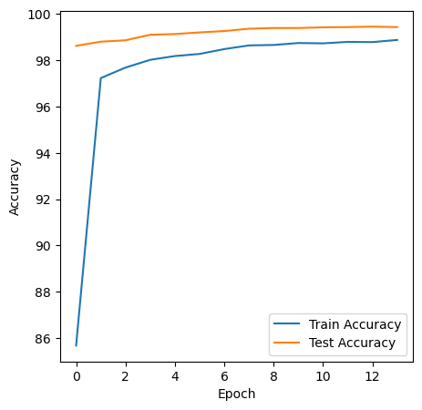

Training a Neural Network with MNIST Data
===============================================

Training a Model with MNIST data is very simple. It’s basically a classification model to look into the image and predict the handwritten digit accurately.MNIST contains 70,000 images of handwritten digits: 60,000 for training and 10,000 for testing. The images are grayscale, 28x28 pixels, and centered to reduce preprocessing and get started quicker. 

All of us can do it. But to make it a little fun we have added some constraints to it. Let’s understand the model input, output and architecture first before getting into the code. SO here is how the readme has been structured

1.	Input 
2.	Constraints
3.	Network 
4.	Parameters
5.	Output
6.	How we arrived at it
7.	Takeaway

# Setting up the Environment

We will be using PyTorch to train a convolutional neural network to recognize MNIST's handwritten digits in this article. PyTorch is a very popular framework for deep learning like Tensorflow, CNTK and Caffe2. But unlike these other frameworks PyTorch has dynamic execution graphs, meaning the computation graph is created on the fly.

Now that we have setup the basics, lets try and experiment to achieve 99.4% or above validation accuracy with less than 8000 parameters. The following description gives a very High level view of 13 different steps for achieving the target( The details are in the individual notebooks)

# Step-1

Typical Structure 
=====================
1. Convolution Layer of 3 x 3 Kernel with Padding of 1 
2. ReLu
3. Maxpool 

Additional Structures
======================
1. Convolution Layer of 1 x 1 Kernel to consolidate without convolution 
2. Global Average Pooling 

Target: 
======

In this step

1. I have choosen vanilla architecture of 6 convolution layer and 2 transtion blocks (maxpool) 
2. Used GAP in the the last layer. 
3. My target is to achieve 99% validation accuracy
4. Once I get 99% accuracy , I know I can refine the mode further to achieve higher accuracy with less parameters
5. Run it for 20 epochs to study how the accuracy changes in vanila architecture

Result: 
======
1. Observed Train accuracy: 99.58%
2. Validation accuracy:99.23%
3. Number of parameters: 40,202

Analysis: 
========

1. I could see that validation accuracy is steadily increasing over epochs, and finally got validation accuracy of 99.23%. This tells me that it is a good architecture to explore further. 

2. I also noticed that train accuracy is 99.58% which is much higher than validation accuracy of 99.23%,. This means that the model is possibly overfitting. But as number of parameters is 40,202 which is around 4 times my target parameters, I will try to reduce the parameters in next step and observe the impact before trying out other options to increase the validation accuracy

# Step2

Typical Structure 
=====================
1. Convolution Layer of 3 x 3 Kernel with Padding of 1 
2. ReLu
3. Maxpool 

Additional Structures
======================
1. Convolution Layer of 1 x 1 Kernel to consolidate without convolution 
2. Global Average Pooling 

Target: 
======

In this step

1. I have choosen vanilla architecture of 6 convolution layer and 2 transtion blocks (maxpool) but reduced the number of channels to keep the number of paramaters less
2. Used GAP in the the last layer. 
3. My target is to achieve near 99% validation accuracy with less than 10,000 parameters
4. Once I avhieve this , the I can refine the model further. 
5. Need to achieve the above accuracy within 15 epochs

Result: 
======
1. Observed Train accuracy: 98.96%
2. Validation accuracy:98.9%
3. Number of parameters: 8,442

Analysis: 
========

1. As expected validation accuracy has  reduced to 98.9% from the vanilla architecure with accuracy 99.23 but almost near to what I would call a candidate for tuning 
2. This reduction in accuracy is for the reduction in number of parameters. But unlike vanilla architecture, the difference between Train Accuray and Validation accuracy is very less, which means it is not overfitting. 
3. Also, number of parameters 8442 is well within my target of 10K parameters

# Step3

Typical Structure 
=====================
1. Convolution Layer of 3 x 3 Kernel with Padding of 1 
2. ReLu
3. Maxpool
4. Dropout              - Regularization Technique  
5. Batch Normalization 

Additional Structures
======================
1. Convolution Layer of 1 x 1 Kernel to consolidate without convolution 
2. Global Average Pooling 

Target: 
======

In this step

1. Added Dropout to the Model architecture from Step-2 
2. Used GAP in the the last layer. 
3. Target is to achieve over 99% validation accuracy with the same number of parameters which is 8582 in step-2
4. If I am able to achieve over 99% accuracy then I would consider the change to be positive and try to enhance further to improve the accuracy 
5. Run it for 15 epochs to study how the change affects the accuracy improvement and also if it's a stable increase 

Result: 
======
1. Observed Train accuracy: 98.69%
2. Validation accuracy:99.35%
3. Number of parameters: 8,582

Analysis: 
========

1. As expected validation accuracy has  improved over 99% and touched 99.35% in this step.It's also important to see that many epochs achieved over 99% accuracy which is a positive sign
2. I also observe that validation accuracy 99.35 is much higher than training accuracy 98.69. These could be because of regularization effect of batch normalization and droupout introudced in this step
3. Also, number of parameters is 8582 is well within my target of 10K parameters

# Step 4
Structure 
=====================
1. Convolution Layer of 3 x 3 Kernel with Padding of 1 
2. ReLu
3. Maxpool
4. Dropout              - Regularization Technique  
5. Batch Normalization 
6. Added Image augmentation of random rotation between -7 to +7 degrees

Additional Structures
======================
1. Convolution Layer of 1 x 1 Kernel to consolidate without convolution 
2. Global Average Pooling 

Target: 
======

In this step

1. Target is to achieve over 99.4% validation accuracy with the same number of parameters. Random rotation should help achieve this as during the visual inspection of the input images I find that few images are rotated , Hence to learn those type of images this augmentation technique should help us achieve the required accuracy %
4. Run it for 15 epochs to study how the accuracy changes with Image Augmentation technique

Result: 
======
1. Observed Train accuracy: 98.5%
2. Validation accuracy:99.37%
3. Number of parameters: 8,582

Analysis: 
========

1. Expected this change would help model achieve over 99.4 % accuracy but it stopped at 99.37% in this step. However it's slightly higher than the step-3 accuracy of 99.35%. 
2. I also observe that validation accuracy 99.37% is much higher than training accuracy 98.5%. These are because with image augmentation effect as well 
3. However points to note is that - Even after few techniques , I am still behind the target of 99.40 validation accuracy and slightly over 8000 Parameters
4. As this showed some improvement , I believe tunign further may improve the accuracy

# Step 5

Structure 
=====================
1. Convolution Layer of 3 x 3 Kernel with Padding of 1 
2. ReLu
3. Maxpool
4. Dropout              - Regularization Technique  
5. Batch Normalization 
6. Image augmentation of random rotation between -7 to +7 degrees

Additional Structures
======================
1. Convolution Layer of 1 x 1 Kernel to consolidate without convolution 
2. Global Average Pooling 
3.  In this step I am going to introducing StepLR with step size 6 and gamma value 0.1. This is the additional feature over the model in Step-4

Target: 
======

In this step

1. Step LR helps to change the leanring rate a little after a fixed number of epochs , which at times helps to converge. So my hope is that it will improve the validation accuracy . So the target is to achieve over 99.4% validation accuracy with same number of parameters 
2. Run it for less than 15 epochs to study how the accuracy changes with StepLR

Result: 
======
1. Observed Train accuracy: 98.39%
2. Validation accuracy:99.25%
3. Number of parameters: 8,582

Analysis: 
========

1. Suprisingly the validation accuracy dropped from the previous step which means that either the StepLR is not helping or the step size is not.
2. Now I have two ways to look at it , The first one is to drop stepLR or use some other mechanism to improve .

# Step 6

Structure 
=====================
1. Convolution Layer of 3 x 3 Kernel with Padding of 1 
2. ReLu
3. Maxpool
4. Dropout              - Regularization Technique  
5. Batch Normalization 
6. Image augmentation of random rotation between -7 to +7 degrees

Additional Structures
======================
1. Convolution Layer of 1 x 1 Kernel to consolidate without convolution 
2. Global Average Pooling 
3.  StepLR with step size 6 and gamma value 0.1. 

Target: 
======

In this step

1. User a lesser value for drop out and see if that helps to improve the validation accuracy 
3. Target is to achieve over 99.4% validation accuracy with same number of parameters
4. Run it for less than 15 epochs to study how the accuracy changes with Image Augmentation technique

Result: 
======
1. Observed Train accuracy: 98.68%
2. Validation accuracy:99.4%
3. Number of parameters: 8,582

Analysis: 
========

1. As expected validation accuracy increased to 99.4% from the last step in which the accuracy dropped to 99.25%
2. Even though the accuracy hit the target of 99.4% but it happended in only one step. At the same time the accuracy jumped a lot and didn't stabilize from lower epoch to higher epoch 
3. This model needs further improvement as it doesn't seems to be a very smooth model

# Step 7

Structure 
=====================
1. Convolution Layer of 3 x 3 Kernel with Padding of 1 
2. ReLu
3. Maxpool
4. Dropout              - Regularization Technique  
5. Batch Normalization 
6. Image augmentation of random rotation between -5 to +5 degrees

Additional Structures
======================
1. Convolution Layer of 1 x 1 Kernel to consolidate without convolution 
2. Global Average Pooling 
3. StepLR with step size 6 and gamma value 0.1. 

Target: 
======

In this step

1. MNIST Dataset is a simple dataset with very little variation. Hence We may not need a higher batch size for the learning rate we are using . At the same time the rotation of (-7 ,+7) might be slightly higher.
2. Hence I want to make the following changes to it 
    a) Change Batch size from 128 to 64 
    b) Modify rotation from (-7,+7) to (-5,+5)

Result: 
======
1. Observed Train accuracy: 99%
2. Validation accuracy:99.42%
3. Number of parameters: 8,582

Analysis: 
========

1. The Validation accuracy increased to 99.42% 
2. It can also be seen that the accuracy has stabilized towards the last few steps which is a good sign 
3. Now as we have achieved our target accuracy I should try optimizing it further 

# Step 8

Structure 
=====================
1. Convolution Layer of 3 x 3 Kernel with Padding of 1 
2. ReLu
3. Maxpool
4. Dropout              - Regularization Technique  
5. Batch Normalization 
6. Image augmentation of random rotation between -5 to +5 degrees

Additional Structures
======================
1. Convolution Layer of 1 x 1 Kernel to consolidate without convolution 
2. Global Average Pooling 
3. StepLR with step size 6 and gamma value 0.1. 

Target: 
======

In this step

1. The Requirement for us is to achieve better accuracy with less number of steps.
2. Knowing MNIST dataset , I believe slightly higher leanring rate may reach the minimum faster , So I am going to increase the LR a little 

Result: 
======
1. Observed Train accuracy: 99.04%
2. Validation accuracy:99.44 %
3. Number of parameters: 8,582

Analysis: 
========

1. As expected the validation accuracy improved and stabilized much better
2. The model also improved from one epoch to another and converged faster

# Step 9
Structure 
=====================
1. Convolution Layer of 3 x 3 Kernel with Padding of 1 
2. ReLu
3. Maxpool
4. Dropout              - Regularization Technique  
5. Batch Normalization 
6. Image augmentation of random rotation between -5 to +5 degrees

Additional Structures
======================
1. Convolution Layer of 1 x 1 Kernel to consolidate without convolution 
2. Global Average Pooling 
3. StepLR with step size 6 and gamma value 0.1. 

Target: 
======

In this step

1. I am going to try and reduce the number of parameters less than 8000
2. I am also going to increase the LR a little more and see if that helps converge faster as the number of parameter is being reduced a little from last step
3. Target is to achieve over 99.4% validation accuracy with less than 8,000 parameters
4. Run it for less than 15 epochs

Result: 
======
1. Observed Train accuracy: 99.04%
2. Validation accuracy:99.42%
3. Number of parameters: 7,836

Analysis: 
========

1. After the model completed all the 14 epochs I saw that the model has overshooted 99.4% accuracy in multiple steps which is a good sign
2. I achieved our target with less number of parameters
3. However I want to try and experiment on reducing the parameter further and see if the model is getting stabilized even further 

# Step 10

Structure 
=====================
1. Convolution Layer of 3 x 3 Kernel with Padding of 1 
2. ReLu
3. Maxpool
4. Dropout              - Regularization Technique  
5. Batch Normalization 
6. Image augmentation of random rotation between -5 to +5 degrees

Additional Structures
======================
1. Convolution Layer of 1 x 1 Kernel to consolidate without convolution 
2. Global Average Pooling 
3. StepLR with step size 7 and gamma value 0.1. 

Target: 
======

In this step

1. I reduced the number of parameters further below 6000
2. I am also going to increase the step size to 7 assuming that the first 6 steps may take the loss closure to the minimum 
3. Target is to achieve over 99.4% validation accuracy with less than 6,000 parameters
4. Run it for less than 15 epochs

Result: 
======
1. Observed Train accuracy: 98.91%
2. Validation accuracy:99.38%
3. Number of parameters: 5,854

Analysis: 
========

1. With less parameters the model could not reach the required accuracy 
2. Having said the above and looking at the pattern of increase in validation accuracy from one epoch to another , I think i can try to optimize it further by keeping the parameters same

# Step 11
Structure 
=====================
1. Convolution Layer of 3 x 3 Kernel with Padding of 1 
2. ReLu
3. Maxpool
4. Dropout              - Regularization Technique  
5. Batch Normalization 
6. Image augmentation of random rotation between -5 to +5 degrees

Additional Structures
======================
1. Convolution Layer of 1 x 1 Kernel to consolidate without convolution 
2. Global Average Pooling 
3. StepLR with step size 7 and gamma value 0.1. 

Target: 
======

In this step

1. In this I increased the parameters a little to make it over 6000. The reason is for me to ensure that parameters play a big role here .
3. Target is to achieve over 99.4% validation accuracy with around 6K parameters and more importantly the consistency 
4. Run it for less than 15 epochs 

Result: 
======
1. Observed Train accuracy: 98.86%
2. Validation accuracy:99.45%
3. Number of parameters: 6,254

Analysis: 
========

1. As expected the model validation accuracy increased to 99.45%
2. The Best part of the model is the way accuracy stabilized from one epoch to another
3. According to me this is the best model i have trained so far of all the steps 
4. Now as I achieved the expected accuracy , let me again try to bring the parameters below 6000 and still achieve accuracy of 99.4%

# Step 12

Structure 
=====================
1. Convolution Layer of 3 x 3 Kernel with Padding of 1 
2. ReLu
3. Maxpool
4. Dropout              - Regularization Technique  
5. Batch Normalization 
6. Image augmentation of random rotation between -5 to +5 degrees

Additional Structures
======================
1. Convolution Layer of 1 x 1 Kernel to consolidate without convolution 
2. Global Average Pooling 
3.  In this step I will change the architecture from step4 by introducing StepLR with step size 7 and gamma value 0.1. 

Target: 
======

In this step

1. I decreased the number of parameters and now it's slightly over 6k 
3. Target is to achieve over 99.4% validation accuracy 
4. Run it for less than 15 epochs to study how the accuracy changes with Image Augmentation technique

Result: 
======
1. Observed Train accuracy: 98.92%
2. Validation accuracy:99.4%
3. Number of parameters: 6,054

Analysis: 
========

1. The accuracy just touched 99.4% but not seems to be stabilized better. I didn't expect this behaviour 
2. I believe that the channel distribution could be wrong. Let me try one last option to play around with channels

# Step 13
Structure 
=====================
1. Convolution Layer of 3 x 3 Kernel with Padding of 1 
2. ReLu
3. Maxpool
4. Dropout              - Regularization Technique  
5. Batch Normalization 
6. Image augmentation of random rotation between -5 to +5 degrees7

Additional Structures
======================
1. Convolution Layer of 1 x 1 Kernel to consolidate without convolution 
2. Global Average Pooling 
3. StepLR with step size 7 and gamma value 0.1. 

Target: 
======

In this step

1. Reduced the number of parameters but the channel size in different conv layers are different, especially keeping the 4 layer structure in mind 
3. Target is to achieve over 99.4% validation accuracy with less than 6,000 parameters
4. Run it for less than 15 epochs to study how the accuracy changes with Image Augmentation technique

Result: 
======
1. Observed Train accuracy: 98.88%
2. Validation accuracy:99.4%
3. Number of parameters: 5,854

Analysis: 
========

1. The model finally achieved 99.4% accuracy and seems to be pretty stable 
2. EVen though I achieved 99.4% with less than 6k parameters, According to me the best model is step 11 where it is more consistent 
3. I will try more to see if i can bring the parameters down some more by keeping the target of 99.4%

# Summary
I could achieve the requirements , however the best step forward would be to reduce the parameters further and see if I can still achieve 99.4% accuracy

