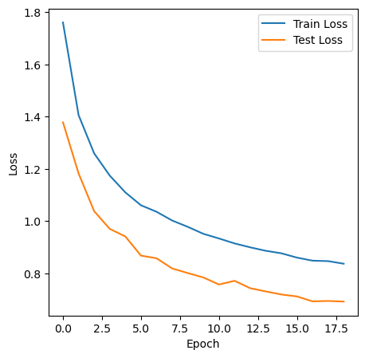
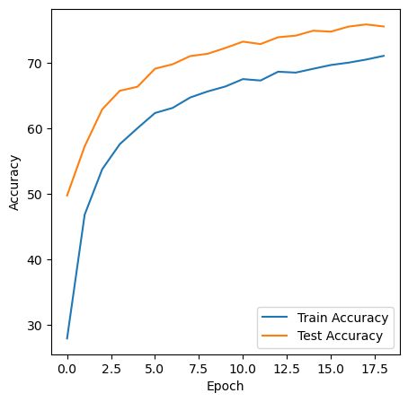
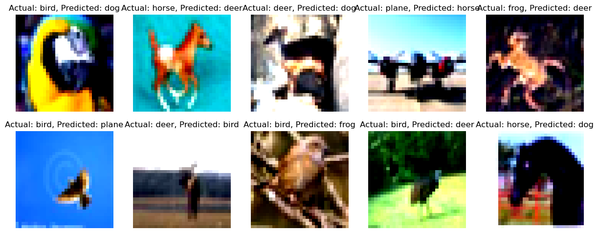
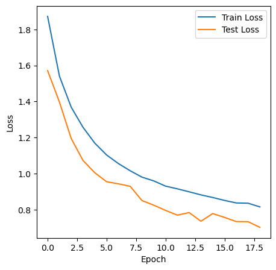
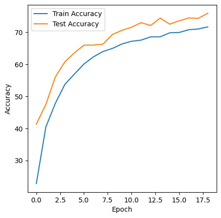
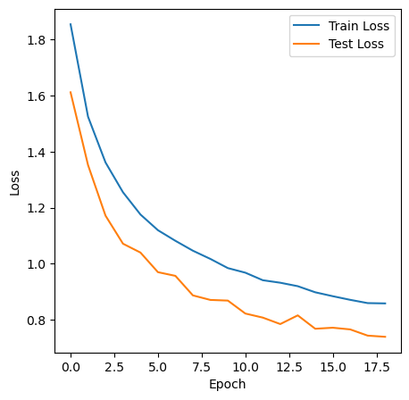
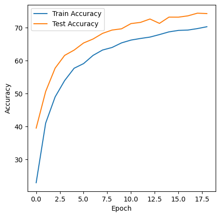

Training a Neural Network with CIFAR10 Data
===============================================

The CIFAR-10 dataset consists of 60000 32x32 colour images in 10 classes, with 6000 images per class. There are 50000 training images and 10000 test images.

The dataset is divided into five training batches and one test batch, each with 10000 images. The test batch contains exactly 1000 randomly-selected images from each class. The training batches contain the remaining images in random order, but some training batches may contain more images from one class than another. Between them, the training batches contain exactly 5000 images from each class.

Here are the classes in the dataset, :
airplane										
automobile										
bird										
cat										
deer										
dog										
frog										
horse										
ship										
truck										

The classes are completely mutually exclusive. There is no overlap between automobiles and trucks. "Automobile" includes sedans, SUVs, things of that sort. "Truck" includes only big trucks. Neither includes pickup trucks.

# Setting up the Environment

We will be using PyTorch to train a convolutional neural network to recognize classes present in CIFAR10 dataset. PyTorch is a very popular framework for deep learning like Tensorflow, CNTK and Caffe2. But unlike these other frameworks PyTorch has dynamic execution graphs, meaning the computation graph is created on the fly.

# Requirements 

Make this network:
C1 C2 c3 P1 C3 C4 C5 c6 P2 C7 C8 C9 GAP C10
Keep the parameter count less than 50000
Try and add one layer to another
Max Epochs is 20
Need to make 3 versions of the above code (in each case achieve above 70% accuracy):
    Network with Group Normalization
    Network with Layer Normalization
    Network with Batch Normalization

Display 10 misclassified images for the BN model, and show them as a 5x2 image matrix in 3 separately annotated images. 

# Model with Batch Normalization 

1. Observed Train accuracy: 70.61%
2. Validation accuracy:75.93%
3. Number of parameters: 30,948

# Misclassified Images

# Model with Group Normalization 

1. Observed Train accuracy: 71.41%
2. Validation accuracy:75.90%
3. Number of parameters: 41,968

# Model with Layer Normalization 

1. Observed Train accuracy: 70.09%
2. Validation accuracy:74.30%
3. Number of parameters: 41,456

# Summary

1. Group Normalization performs better than Layer normalization 
2. Batch Normalization performs better than Group normalization
3. Adding previous layer ouput improves the validation accuracy 

